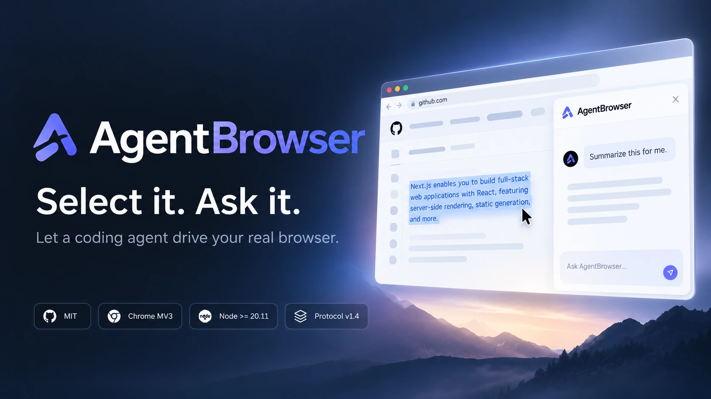

<div align="center">



**选中它，问它。**

一个 Chrome 侧边栏：Agent 既能和你对话，又能通过可信 CDP 输入控制你
**真实登录态**的浏览器——现在更支持对页面选中文本直接提问。

[](LICENSE)
[](extension/manifest.json)
[](server/package.json)
[](PROTOCOL.md)

[English](README.md) · **简体中文**

</div>

---

本项目是 [VasiHemanth/agentbrowser](https://github.com/VasiHemanth/agentbrowser)
的 fork，补齐了 ContextLens 式的「选中即问」交互，并引入了更严格的
错误处理规范。

**[PROTOCOL.md](PROTOCOL.md)** 是协议的唯一事实来源 ·
**[DESIGN.md](DESIGN.md)** 讲设计动机 ·
**[AGENTS.md](AGENTS.md)** 记仓库约定。

## 目录

- [本分支 vs 上游](#本分支-vs-上游)
- [为什么用 CDP](#为什么用-cdp)
- [架构](#架构)
- [安装](#安装)
- [选中即问](#选中即问)
- [页面标注](#页面标注)
- [检查页面](#检查页面)
- [Tab、文件与语音](#tab文件与语音)
- [选模型](#选模型)
- [API key](#用-api-key-代替-cli)
- [接管表单](#接管表单)
- [适配器](#适配器)
- [接入任意其他 harness](#接入任意其他-harness)
- [浏览器工具](#浏览器工具)
- [测试](#测试)
- [已知限制](#已知限制)

## 本分支 vs 上游

| | [VasiHemanth/agentbrowser](https://github.com/VasiHemanth/agentbrowser) | **本分支** |
|---|:---:|:---:|
| 侧边栏对话 + 可插拔 Agent 后端（SDK、CLI、API 适配器） | ✓ | ✓ |
| 可信 CDP 输入，跑在你真实登录的浏览器上——无需自动化专用 Profile、无需重新登录 | ✓ | ✓ |
| 当前 Tab 上下文、`@` 跨 Tab 引用、附件、语音输入 | ✓ | ✓ |
| `mcp-proxy.mjs` — 任意支持 stdio MCP 的 Agent 均可驱动浏览器 | ✓ | ✓ |
| **选中文字 → 光标处浮出「Ask」按钮** | — | ✓ |
| **右键菜单 → "Ask AgentBrowser"** | — | ✓ |
| **选中内容自动补上下文** — 语义化 DOM 路径、最近章节标题、±800 字符上下文、所在 `<pre>`/代码块（含语言识别）、表格表头+当前行渲染为 markdown → `context.selection`（协议 v1.4） | — | ✓ |
| **页面标注** — `annotate`/`annotations_list`/`annotate_reply`/`annotate_clear` 工具；下划线、荧光笔、圈选引用文本；每条标注的评论卡片跑自己的会话（协议 v1.5） | — | ✓ |
| **主动共读标注** — 可选 `proactiveAnnotation` 配置：每页跑一轮后台 pass，标记疑难段落并附原因 | — | ✓ |
| **先观察再驱动** — BBX 式结构化读取（`dom_inspect`、`console_log`、`network_log` + 脱敏 HAR、`a11y_tree`、弹窗处理）与可逆实时补丁（`patch_apply`/`patch_revert`）（协议 v1.6） | — | ✓ |
| **免 MCP 的 Skill + CLI 接入** — `agentbrowser <tool> '<json>'` 命令行 + SKILL.md 安装器，给不支持 MCP 的 Agent 用 | — | ✓ |
| **同意门 + 元素级点击** — `permissions` 配置让敏感工具执行前必须经你确认（页内确认卡或系统通知）；`click_element {selector}` 直接点元素（协议 v1.7） | — | ✓ |
| **禁止静默 catch** — 每个 catch 必须按影响分级记日志或向上抛出 | — | ✓ |

> 致谢上游：侧边栏 ↔ hub ↔ 适配器的整体架构、最初的十个浏览器工具、
> 以及全部适配器均为上游项目的工作成果。本分支新增了选中交互层、
> 标注层和约定文档。
>
> 第三方致谢：`extension/selection.js` 中的选中内容提取代码（标题/表
> 格/代码块捕获、语义化路径、浮窗 Ask 按钮）改编自
> [cola-sk/context-lens](https://github.com/cola-sk/context-lens)（MIT），
> 文件头部亦有标注。

## 为什么用 CDP

Content script 发出的合成事件带有 `isTrusted: false`，现代编辑器
（Lexical、React composer）会直接忽略。而 `chrome.debugger` 派发的
输入是可信的：CDP 点击和 `Input.insertText` 与真人操作完全等价
（已于 2026-08-01 在 Threads 编辑器上验证）。由于扩展附着在你已有的
浏览器 Profile 上，不存在独立的自动化 Profile，也无需重新登录。
Agent 主循环本身从不触碰页面 DOM——所有动作都走 `chrome.debugger`。
两个小 content script（`extension/selection.js` 监听文本选中，
`extension/annotation.js` 渲染标注与评论卡片）都不驱动页面。
为此 manifest 在
`debugger, tabs, storage, offscreen, sidePanel` 之外追加了
`contextMenus, scripting` 和 `*://*/*` 主机权限。

## 架构

```
side panel  <-- runtime Port -->  service worker  <-- offscreen doc / WebSocket -->  hub (127.0.0.1:9010)
     ▲                                  |                                              |
     │                            chrome.debugger                              adapters (SDK, CLI, API)
selection.js                      (CDP executor)                              mcp-proxy.mjs (external harnesses)
(content script)
```

Hub（`server/hub.mjs`）在面板与当前适配器之间转发对话，并把任意
harness 的工具调用转发给扩展，由扩展经 CDP 执行并回传结果。content
script 捕获的选中文本按 content script → service worker →
`chrome.storage.session` → 面板的路径传递，随下一条消息以
`context.selection` 发出。

## 安装

**环境要求**

- Chrome（或任意支持 `chrome.debugger` 与 `sidePanel` 的 Chromium）
- Node.js 20.11+
- 至少一个后端：`PATH` 上的编码 CLI，或 Anthropic/OpenAI API key

**1 · 启动 hub**

```bash
git clone https://github.com/lucgray/agentbrowser.git
cd agentbrowser/server
npm install
npm start          # 监听 ws://127.0.0.1:9010
```

**2 · 加载扩展**

1. 打开 `chrome://extensions`，开启开发者模式。
2. 「加载已解压的扩展程序」，选择本仓库的 `extension/` 目录。
3. 点击工具栏的 AgentBrowser 图标打开侧边栏；hub 连通后状态点变绿。

输入消息，如需切换后端在下拉框选适配器（默认取自
`server/config.json`），发送即可。工具活动以紧凑 chip 形式显示在
对话流中。

> **提示** — 可用 `AGENTCHAT_PORT` 覆盖端口。想让 hub 跨登录常驻，
> [server/autostart.md](server/autostart.md) 里有 macOS 的 launchd 方案
> （plist 放在仓库外）。日志写到 `/tmp/agentchat-hub.log`。如果 hub 报
> 端口被占用，说明已有 autostart 副本在运行。

## 选中即问

*本分支的标志性功能。*

- **浮窗 Ask** — 在页面上划选任意文字，光标处会出现 **Ask** 按钮。
  点击后侧边栏打开，选中内容以可移除的 chip 暂存在输入框里。
  浮窗可能和其他悬浮 UI 冲突：在右键菜单里取消勾选
  **Floating Ask button on selection** 即可关闭（持久化在
  `chrome.storage.local`，立即生效；Esc 也可临时关闭当前这一次）。
- **右键菜单** — 右键点击选中区域，选择 **Ask AgentBrowser**。
- **自动补富上下文** — 下一条消息携带 `context.selection`（协议
  v1.4）：选中文本 + 语义化 DOM 路径（如 `article > section > pre`）、
  最近章节标题、±800 字符上下文；若选中内容位于代码块或表格内，还会
  带上整个外层块——代码块含识别出的语言，表格渲染为 markdown 的
  表头+当前行。

Agent 能完整看到这些信息，所以「解释一下这个」「这个正则做什么」
「总结这张表」都精确作用于你划选的内容。

## 页面标注

*Agent 陪你一起读，而不只是替你读。*

- **三种标注** — Agent 可调用 `annotate` 在任意引用文本上留下下划线、
  荧光笔或圈选（协议 v1.5）。标注实时渲染到页面：下划线和荧光笔是
  带样式的 span，圈选是 SVG 覆盖层上的椭圆。
- **标注上的评论串** — 点击标注打开评论卡片。你的评论会作为一次会话
  发到面板当前使用的适配器（可在配置中指定）；回复流式回写到同一张
  卡片，每条标注长出自己的讨论串。`annotate_reply` 让 Agent 在串内
  定向回复，不必走完一整轮。
- **主动标注（可选）** — 在 `server/config.json` 里设置
  `proactiveAnnotation`，Agent 会对每个页面跑一轮后台 pass：读完
  标签页后标出它认为难懂的段落，每条标注带上「为什么标」的说明，
  并用与你不同的颜色区分。

```jsonc
// server/config.json
{
  "adapter": "claude-agent-sdk",
  "proactiveAnnotation": {
    "enabled": true,
    "adapter": "devin",   // 任意适配器名；默认沿用当前会话的适配器
    "prompt": "..."       // 可选：覆盖内置的共读提示词
  }
}
```

`annotations_list` 返回某个标签页上所有标注与评论串——方便让它生成
「我们在这页留下的所有批注」摘要；`annotate_clear` 删除单条或全部
标注。

## 检查页面

*先观察、再驱动* —— BBX 式结构化读取让 Agent 基于真实页面状态工作，
而不是截图；另有可逆的实时补丁，先在页面上"证明"改动效果再动源码
（协议 v1.6）。

| 工具 | 返回 |
|---|---|
| `dom_inspect` | 匹配 CSS 选择器的元素：tag、id、class、全部属性、文本、包围盒、计算样式——不整页 dump |
| `console_log` | console 调用、未捕获异常、浏览器日志的环形缓冲区，可按级别过滤 |
| `network_log` | 最近请求的方法/状态/mimeType/耗时/大小；`har:true` 导出脱敏的 HAR 1.2（凭据类 header 一律剔除） |
| `a11y_tree` | 页面无障碍树（role + name + depth），不可用时回退为 DOM 语义大纲 |
| `dialog_list` / `dialog_respond` | debugger 附着期间拦截 alert/confirm/prompt：可列出、可应答、约 5 秒未应答自动取消（避免页面卡死） |
| `patch_apply` / `patch_revert` | 实时改 CSS/属性/HTML/删元素并快照 outerHTML，按元素逐项还原 |

采集是惰性的：第一次调用才在已附着的 debugger 会话上开启对应 CDP
域；缓冲区随导航重置，全程无需打开 DevTools。

## Tab、文件与语音

每次发送的不只是你打的字。

- **Tab 上下文** — 你正在看的标签页随每条消息发送，所以「总结这个
  页面」「帮我填这个表单」无需粘贴 URL。harness 拿到它的 tabId，用于
  `read_page`、`screenshot`、`eval_js`。
- **`@` 引用** — 在输入框敲 `@`，按标题挑选其他已打开的标签页。同时
  引用两个标签页就可以让它们做对比。
- **附件** — 拖文件进输入框或点选。面板将其 base64 编码，hub 写到
  `<tmpdir>/agentchat-uploads/<chatId>/<name>`，再把绝对路径告诉
  harness，由它用文件工具打开。单条消息解码后总大小上限 8 MB。chat
  会话销毁时上传目录一并删除。
- **语音** — 麦克风按钮把口述填入输入框——只填字，不发送。

## 选模型

适配器下拉框由 hub 填充，不是写死的：连接时 hub 会告诉面板有哪些
适配器、各自的名字、能跑哪些模型、默认用哪个。无模型切换的适配器
（多数 CLI 读自己的配置）模型列表为空。

会话中换模型会重启该 chat 的 session——因为模型在 session 创建时
定死。对话流会出现一行 "session restarted with model X"，下一轮从
零开始。不换模型则一切照旧。

## 用 API key 代替 CLI

`anthropic-api` 和 `openai-api` 两个适配器直接调厂商 API，不起 CLI
子进程。适合没装/没登录对应 CLI，或想钉住某个具体模型而不动 CLI
配置的场景。

它们需要 key：粘到面板里，hub 会写入 `~/.agentchat/keys.json`（文件
0600、目录 0700），这是它唯一的去处。key 除了发往对应厂商的请求外
绝不离开本机，不会回传给面板（面板只能知道 key 有没有设置过），也
不会出现在 hub 日志、聊天消息或报错里。清空输入框即删除 key。

API 适配器拿到的浏览器工具与 CLI 适配器完全相同，所以「总结页面」
「填表单」行为一致。但它们没有 CLI 的文件和 shell 工具，附件对它们
来说只是打不开的路径——需要读本地文件的轮次请用 CLI 适配器。

给没配 key 的 API 适配器发消息不会启动任何进程：对话流直接报缺少
哪个 key，本轮结束。

## 接管表单

让 harness 帮你填当前打开的表单：它会先读表单（label、name、类
型、现值），逐个字段点击并用可信 CDP 输入，最后读回值供你核对。

除非你在对话里明确要求，它不会点提交/发送/发布/购买。填表不等于授
权提交。要走完整个流程就说清楚："fill it and submit"。

## 动手前先问你：同意门

提示词约定之外还有一道硬门。在 `server/config.json` 里加
`permissions` 块：

```json
{
  "permissions": {
    "requireConsent": ["click", "click_element", "type_text", "navigate"],
    "trustedDomains": ["localhost", "internal.example.com"],
    "sensitiveDomains": ["yourbank.com"]
  }
}
```

名单里的工具每次执行前都会弹确认：目标页右上角出现确认卡，把动
作写具体（`click 'button.buy' → button "Buy now"`、`navigate →
github.com/settings`），你选 **Allow once**（仅本次）、**Always on
this domain**（本会话内该域放行）或 **Deny**（拒绝）。卡片注入不
了的页面（chrome://、PDF）退回系统通知。纯读类工具（`read_page`、
`dom_inspect`、截图……）永不拦截；不配这个块则完全不拦。
`sensitiveDomains` 每次必问且无视会话记忆，`trustedDomains` 永不
问。`eval_js` 默认在写操作名单里——它能跑任意代码，想把它移出名单
需要你显式指定 `requireConsent`。

## 适配器

按 chat 选择，或配置在 `server/config.json`：

| 适配器 | 调用方式 | 会话 | 说明 |
|---|---|---|---|
| `claude-agent-sdk` | 进程内（`@anthropic-ai/claude-agent-sdk`） | 每个 chat 一个 SDK session | 浏览器工具以进程内 MCP server 暴露给模型；截图以图片返回 |
| `claude-cli` | `claude -p`，stream-json | 子进程在整个 session 期间存活 | 完整 Claude Code 工具集（文件、bash）+ 生成的 MCP 配置接入浏览器工具 |
| `anthropic-api` | Anthropic API | 按 chat | 需要 API key，无需 CLI |
| `openai-api` | OpenAI API | 按 chat | 需要 API key，无需 CLI |

<details>
<summary><b>另外七个 CLI</b> — 由 <code>server/adapters/generic-cli.mjs</code> 统一包装：每轮起一个进程，轮次间恢复 CLI 自己的会话，浏览器工具经 <code>mcp-proxy.mjs</code> 接入</summary>

| 适配器 | 启动命令 | 续接方式 | MCP 接入 |
|---|---|---|---|
| `codex` | `codex exec --json` | `codex exec resume <thread id>` | 每次调用以 `-c mcp_servers.browser.*` 覆盖项挂载 |
| `opencode` | `opencode run --format json` | `-s <sessionID>` | 临时目录生成 `opencode.json`，并以该目录为 cwd |
| `copilot` | `copilot -p ... -s` | `--session-id <uuid>` 每轮复用 | `--additional-mcp-config` |
| `grok` | `grok -p ... --output-format json` | `--resume <sessionId>` | 临时 cwd 生成 `.grok/config.toml` |
| `agy` | `agy -p ...` | `--conversation <id>`（首轮后比对会话目录拿 id，失败回退 `-c`） | 只在全局 `~/.gemini/config/mcp_config.json` 注册一次（merge-only） |
| `gemini` | `gemini -p ... -o stream-json` | `-r <session_id>` | 临时 cwd 生成 `.gemini/settings.json`；其他 server 用 `--allowed-mcp-server-names browser` 排除 |
| `devin` | `devin -p <prompt> --respect-workspace-trust false --permission-mode dangerous` | 在 chat 专属临时 cwd 里 `-c`（会话按 cwd 划分） | 临时 cwd 生成 `.devin/mcp_config.json` |

每个 CLI 都在你的 `PATH` 上查找。路径特殊的话用
`AGENTCHAT_BIN_<NAME>` 指定绝对路径，例如
`AGENTCHAT_BIN_CODEX=/opt/homebrew/bin/codex`。

</details>

## 接入任意其他 harness

`server/mcp-proxy.mjs` 是一个 stdio MCP server，把工具调用经
WebSocket 转发给 hub。任何支持 MCP 的 harness 只要在 MCP 配置里加上
它就能驱动浏览器：

```json
{
  "mcpServers": {
    "agentbrowser": {
      "command": "node",
      "args": ["/absolute/path/to/agentbrowser/server/mcp-proxy.mjs"]
    }
  }
}
```

启动 hub、保持扩展加载，harness 就拿到与内置适配器相同的工具，无需专属适配器。Cursor、Cline、Qwen CLI、Codex、Gemini CLI、
Claude Code 都接受这种形态的配置，只是文件名不同（Codex 用
`config.toml`，Gemini 用 `settings.json`，Claude Code 用 `.mcp.json`）。

<details>
<summary><b>使用不同键名的客户端</b></summary>

| 客户端 | 配置位置 |
|---|---|
| [OpenClaw](https://docs.openclaw.ai/cli/mcp) | `openclaw.json` 的 `mcp.servers`，或 `openclaw mcp add browser --command node --arg <path>` |
| [Muse Code](https://dev.meta.ai/docs/muse-code/extending) | 设置文件里的 `mcp_servers`，加 `"transport": "stdio"` |
| [Hermes Agent](https://hermes-agent.nousresearch.com/docs/user-guide/features/mcp) | `~/.hermes/config.yaml` 的 `mcp_servers`，或 `hermes mcp add browser --command node --args <path>` |

</details>

唯一硬性要求是 **stdio** transport——`mcp-proxy.mjs` 就是 stdio
server。只会走 HTTP 的 MCP 客户端暂时接不上。

## 免 MCP 接入：Skill + CLI

对不支持 MCP server、或不想改配置文件的 Agent，
`server/agentbrowser-cli.mjs` 把全部浏览器工具暴露为命令行——同一套
工具、同一个 hub、无常驻进程：

```bash
node server/agentbrowser-cli.mjs read_page '{}'
node server/agentbrowser-cli.mjs dom_inspect '{"selector":"h1"}'
node server/agentbrowser-cli.mjs tools              # 列出工具
```

`npm run install-skill`（或 `node server/install-skill.mjs`）会在
`~/.local/bin` 写入 `agentbrowser` 启动脚本，并把
`server/skill/SKILL.md` 铺到 `~/.claude/skills` 与 `~/.agents/skills`
（其他目录用 `--target <dir>`）。读 skill 的 Agent（Claude Code、
任意 `.agents` 布局）由此获得浏览器控制，**完全不需要 MCP 配置**。
CLI 无状态——缓冲区与 debugger 附着都在扩展侧，一次调用一个进程不
丢任何东西。

<details>
<summary><b>Python agent 框架</b> — LangGraph / DeepAgents，经 <code>langchain-mcp-adapters</code> 加载</summary>

```python
from langchain_mcp_adapters.client import MultiServerMCPClient

client = MultiServerMCPClient({
    "agentbrowser": {
        "command": "node",
        "args": ["/absolute/path/to/agentbrowser/server/mcp-proxy.mjs"],
        "transport": "stdio",
    }
})
tools = await client.get_tools()
```

</details>

## 浏览器工具

| 工具 | 参数 | 返回 |
|---|---|---|
| `tabs_list` | `{}` | `{tabs:[{tabId,url,title,active}]}` |
| `tab_new` | `{url?}` | `{tabId}` |
| `tab_close` | `{tabId}` | `{closed:true}` |
| `navigate` | `{url, tabId?}` | `{url, title}`（加载完成后，上限 20s） |
| `read_page` | `{tabId?, maxChars?}` | `{url, title, text}`（innerText，默认截断 60k 字符） |
| `screenshot` | `{tabId?}` | `{base64, mimeType:"image/png"}` |
| `click` | `{x, y, tabId?}` | `{clicked:true}` |
| `click_element` | `{selector, dx?, dy?, tabId?}` | `{clicked:true, selector, tag}`（先滚入视口，点元素中心） |
| `type_text` | `{text, selector?, tabId?}` | `{typed:<字符数>}`（可选 `selector` 先点击聚焦目标） |
| `press_key` | `{key, tabId?}` | `{pressed:key}`（如 "Enter"、"Escape"、"Meta+A"） |
| `eval_js` | `{expression, tabId?}` | `{value}` |
| `dom_inspect` | `{selector, all?, styles?, max?, tabId?}` | `{selector, matched, elements:[...]}` |
| `console_log` | `{level?, limit?, clear?, tabId?}` | `{entries:[{ts,level,source,text,url}]}` |
| `network_log` | `{filter?, includeHeaders?, har?, limit?, clear?, tabId?}` | `{entries:[...], har?}`（凭据类 header 一律剔除） |
| `a11y_tree` | `{maxDepth?, tabId?}` | `{source, nodes:[{role,name,depth,...}]}` |
| `dialog_list` | `{tabId?}` | `{dialogs:[{type,message,url,ts,status}]}` |
| `dialog_respond` | `{accept, promptText?, tabId?}` | `{handled, ...}` |
| `patch_apply` | `{patches:[{selector,styles?,attributes?,insertAdjacentHTML?,remove?}], label?, tabId?}` | `{patchId, applied, results}` |
| `patch_revert` | `{patchId, tabId?}` | `{patchId, reverted, missing}` |

省略 `tabId` 即当前活动标签页。service worker 按需 attach
debugger，每个标签页串行执行命令，被 Chrome 断开后自动重连。

## 测试

```bash
cd server
npm test           # pricing、API 适配器、协议 v1.3
npm run test:e2e   # 真实 hub + 真实 WebSocket 的端到端测试
npm run smoke      # hub 路由往返；需另一个终端先 `npm start`

cd ../extension
node --test markdown.test.mjs overlay.test.mjs sidepanel.test.mjs sidepanel.dom.test.mjs
```

所有测试都不花模型 token、不起 CLI。端到端套件通过
`AGENTCHAT_ADAPTER_MODULE` 把 hub 指向 `server/stub-adapter.mjs`。

## 已知限制

- Chrome 每个标签页只允许一个 debugger 客户端。如果某标签页开着
  DevTools 或被其他 CDP 客户端占用，该页的工具调用会失败，直到对方
  断开。换个标签页或关掉 DevTools 即可。
- debugger attach 期间 Chrome 会显示 "is being debugged" 提示条；把
  它关掉会断开 debugger，下一次工具调用会自动重连。
- hub 只接受一个扩展连接。在第二个 Chrome Profile 或窗口里加载扩展
  会挤掉前一个：旧 socket 被关闭，其未完成的工具调用以
  "displaced" 失败。
- 工具调用在 hub 侧 60 秒超时。
- 适配器 session 按 chat 保留，空闲 30 分钟后销毁；之后用旧 chatId
  发消息会新建 session。会话中切换适配器或模型下拉框也会结束旧
  session，下一轮从零开始。
- API key 按 provider 而非适配器存储：一个 Anthropic key 供所有走
  Anthropic 的适配器使用。key 以明文存在
  `~/.agentchat/keys.json`，靠文件权限保护，未加密。

---

<div align="center">

**许可证** — MIT · 见 [LICENSE](LICENSE) · 上游部分 ©
[VasiHemanth/agentbrowser](https://github.com/VasiHemanth/agentbrowser)（MIT）

</div>
